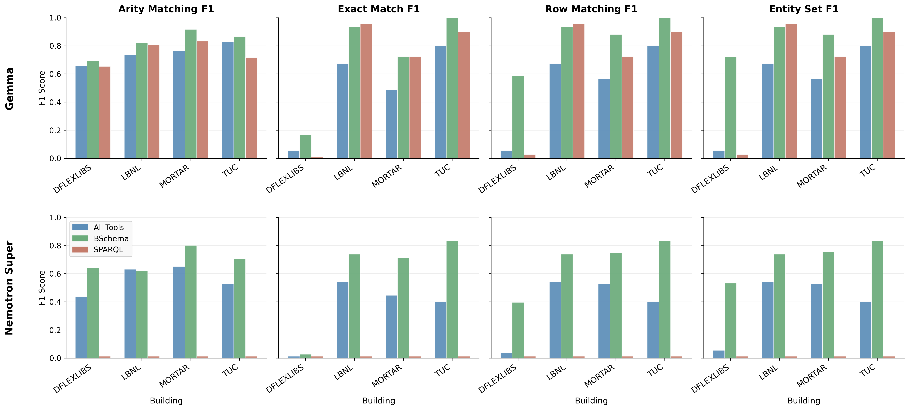
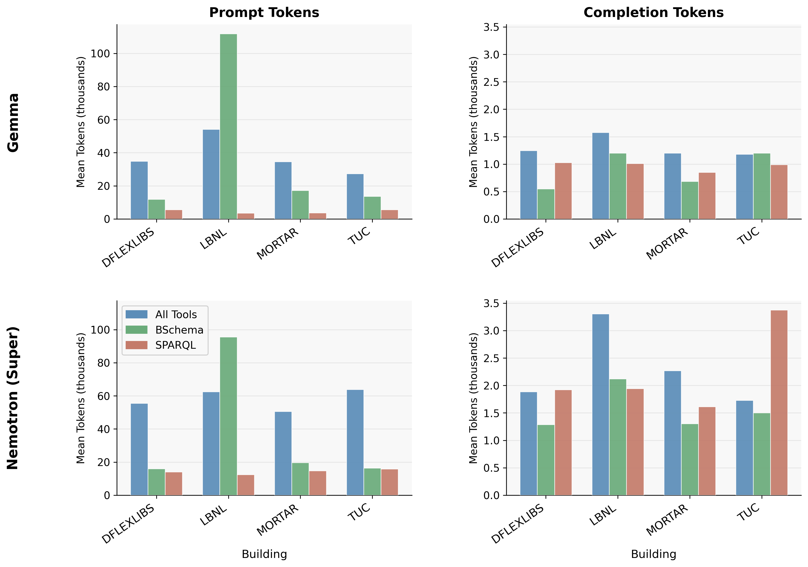

# kgqa-agent

An experiment harness that points an LLM agent (via [pydantic-ai](https://ai.pydantic.dev/)) at
a building's RDF graph with a small set of MCP tools, asks it to translate natural-language
questions into SPARQL, and scores the generated query against ground truth across several
metrics (arity, entity-set, row-matching, exact-match F1) using BuildingQA. 

## Repository layout

```
kgqa-agent/
├── agents/
│   ├── kgqa.py     # MCP tool definitions (graph navigation + sparql-relax-backed query tools)
│   └── agent.py     # SimpleSparqlAgentMCP: single-pass execution + evaluation/logging
├── scripts/
│   ├── benchmark.py            # main entry point: runs a config against all benchmark buildings
│   ├── recalculate_metrics.py  # re-score an existing results CSV
│   ├── aggregate_metrics.py, analyze_failures.py, analyze_tool_usage.py, visualize_*.py
│   ├── metrics.py, namespaces.py, utils.py
│   └── run_all_analysis.sh     # aggregate + visualize + tool-usage over a directory of CSVs
├── configs/          # configurations for agent runs - gitignored
├── example_configs/  # Format of configurations for agent runs
├── data/             # bundled subset of BuildingQA (see below)
├── tests/            # unit tests + a small local fixture graph (test-building.ttl)
├── results/           # ignored - populates results from runs
└── performance/       # selected results for benchmarking of agents
```

## Setup

Requires [`uv`](https://docs.astral.sh/uv/) and a Rust toolchain (to build `sparql-relax-rs`
the first time — cached by uv/maturin afterwards).

```sh
uv sync
```

Each config in `configs/` needs `api-key` filled in (a placeholder is checked in — no live
credentials are committed here) before you can run a benchmark.

## Running a benchmark

```sh
cd scripts
uv run python benchmark.py --config ../configs/gemma/gemma-sparql.json
```

Results are appended to a timestamped CSV under `results/`. To resume a partially-completed run:

```sh
uv run python benchmark.py --config ../configs/gemma/gemma-sparql.json --resume ../results/<...>.csv
```

Then aggregate/visualize:

```sh
bash ./scripts/run_all_analysis.sh ../results/gemma
```

## Architecture

`agents/kgqa.py` builds five [FastMCP](https://github.com/modelcontextprotocol/python-sdk)
toolsets (`all_tools`, `graph_tools`, `bschema_tools`, `sparql_only`, `sparql_no_validation`). 
the key results compare `all_tools`, `bschema_tools`, and `sparql_only`. 
 `agents/agent.py` wires whichever toolset a config asks
for into a pydantic-ai `Agent` via `FastMCPToolset`.

The graph-navigation tools (`describe_entity`, `get_building_summary`, `find_entities_by_type`,
`get_relationship_between_classes`, `find_similar_class_in_graph`, `describe_class`) 
run directly against an in-memory rdflib/Oxigraph graph.

The two SPARQL-execution tools are thin wrappers around
[sparql-relax-mcp](https://github.com/lazlop/sparql-relax/tree/main/sparql-relax-mcp):

- **`sparql_validator(query, relax=False)`** — calls sparql-relax's `diagnose`, then `query` for
  a 5-row preview if it succeeds. On a query that returns nothing, the response explains *which*
  triple pattern or `FILTER` is responsible instead of just coming back empty. Pass `relax=True`
  to also have sparql-relax search the graph's real edges for a corrected query.
- **`sparql_snapshot(query)`** — calls sparql-relax's `query` directly for a 10-row preview, no
  diagnosis. This is the "no validation" arm (`sparql_no_validation` toolset).

The `sparql_query()` function in `agents/kgqa.py` is **not** an MCP tool — it's called directly
by `agents/agent.py`'s evaluation harness to score a generated query against ground truth,
independent of whichever toolset the agent itself used.

Every building has two RDF files, and the agent loads both:

- **`with_ontology_graph_file`** (`WITH_ONTOLOGY_GRAPH_FILE` env var) — the full graph: the
  reference ontology (Brick/223P) merged in, plus inferred/expanded classes. This is the graph
  `sparql_validator`/`sparql_snapshot`/`sparql_query()` actually run queries against. 
  Some questions may need the inferred triples to be answered correctly.
- **`without_ontology_graph_file`** (`WITHOUT_ONTOLOGY_GRAPH_FILE` env var) — the lean,
  instance-only graph: no ontology schema triples, no inferred/expanded classes.
  Tools that walk the graph directly rather than running SPARQL — `describe_entity`, `get_building_summary`, `find_entities_by_type`, `get_relationship_between_classes` (shortest-path search) — use this one, so ontology noise
  and inferred edges don't distort what they surface.

`agents/kgqa.py`'s `_ensure_graph_loaded()` loads both into memory as `graph` (without ontology)
and `parsed_graph` (with ontology) and returns both; individual tool functions pick whichever one
they need.

## Data

`data/` is a bundled subset of [BuildingQA](https://github.com/INFERLab/BuildingQA)

`data/bschema/threshold-{0,30,70}/` — B-Schema summaries (structural graph compressions) at
  different pruning thresholds, used by the `bschema_tools` toolset/configs. 

## The B-Schema

The B-Schema summaries were generated for this study using the repo [bschema](https://github.com/lazlop/bschema)

BSchema is a compact summary of a building's knowledge graph. It provides an LLM exactly the information it needs to query the a knowledge graph by finding the unique connected subgraphs and eliminating repetition. Rather than handing an LLM agent the full graph, forcing it to explore the graph via tools at runtime, or giving it a summary in a less relevant format, BSchema pre-computes a condensed representation that groups instances by their local structural patterns. 

The summary is built by iteratively comparing each node's local neighborhood (converted to a "class graph" of types and relations) against previously discovered patterns, merging nodes with equivalent topology and relabeling ones that differ. A tunable similarity threshold (`τ`) controls how aggressively similar-but-not-identical subgraphs get merged: `τ = 1.0` produces an exact structural map, while lower thresholds (e.g. `τ = 0.7`, used for the results) trade a small amount of structural precision for an order-of-magnitude smaller summary.

## Results

Evaluated on the [BuildingQA](https://github.com/INFERLab/BuildingQA) benchmark (188 practitioner questions across four real buildings: DFLEXLIBS, MORTAR, TUC on Brick; LBNL on ASHRAE S223), comparing `bschema_tools`, `sparql_only`, and `all_tools` across two open-weight LLMs.

### Row matching F1 (primary metric)

| Model    | SPARQL Validator only | BSchema (proposed) | All MCP Tools |
|----------|:---------------------:|:-------------------:|:-------------:|
| Gemma    | 0.68                   | **0.86**             | 0.53          |
| Nemotron | 0.00                   | **0.69**             | 0.42          |

BSchema consistently wins across every metric (arity, exact-match, entity-set, row-matching) except arity, for both models. Most strikingly, Nemotron scores **0.00 across all metrics** with only the SPARQL validator (a near-total failure to produce executable queries — 85% of queries had vocabulary hallucinations, 55% had syntax errors), but reaches **0.69 row F1** once given a BSchema summary, showing that a good static structural summary can substitute for weak intrinsic SPARQL ability.

The proposed BSchema method provides strong results across each of the buildings in BuildingQA. 


### Cost per query

| Model    | Method                | $/query   | Row F1 |
|----------|------------------------|-----------|--------|
| Gemma    | SPARQL Validator only  | $0.0009   | 0.68   |
| Gemma    | **BSchema**            | $0.0048   | **0.86** |
| Gemma    | All MCP Tools          | $0.0051   | 0.53   |
| Nemotron | SPARQL Validator only  | $0.0022   | 0.00   |
| Nemotron | **BSchema**            | $0.0038   | **0.69** |
| Nemotron | All MCP Tools          | $0.0055   | 0.42   |



### Previous methods

BSchema also beats prior published baselines by a wide margin: the [BuildingQA paper's](https://dl.acm.org/doi/abs/10.1145/3736425.3770097) best ReAct configuration reaches 0.38 row F1 at $0.08/query, and [BrickQA's](https://dl.acm.org/doi/pdf/10.1145/3744256.3812570) best configuration reaches 0.60 row F1 at $0.026/query.  BSchema exceeds both at roughly 5–10x lower cost.
